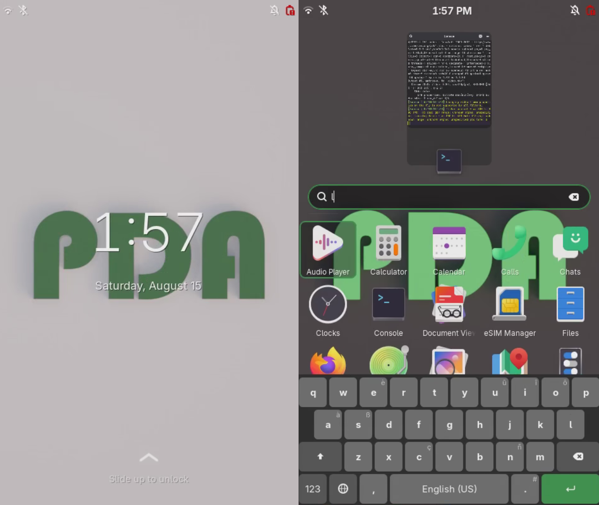

# Pocket Distro Alpha OS

This repository contains tools and configuration to install PostmarketOS plus
Pocket Distro Alpha software and configuration onto a Raspberry Pi 5 based
smartphone-like device.

A two command install can put the operating system on an SD card. The default
install includes the PDA demo app and hotswap daemon. A dsi display is also
enabled.



*Screenshot of the lock and home screens*

# Prerequisites

* Micro SD card
* Linux (A virtual machine with SD card access works)
* Nix with flakes

The recommended way is to start a linux virtual machine that can read and
write to the Micro SD card.

### Hardware Configuration

At a minimum, a Raspberry Pi 5 is needed. The current configuration uses a DSI
display, specifically the BigTreeTech TFT50 v2.0. The display is not needed
if other peripherals that will work out of the box are used, like an HDMI
display or USB keyboard. Other hardware support may require modifying the
Pi's `usercfg.txt`.

## Windows

TODO

## MacOS

TODO

## Linux

Nix can be installed on top of any linux distro.
https://nixos.org/download/#nix-install-linux

## Running Inside a Virtual Machine

If you can't access the SD card from inside a VM, you may want to make an image
inside the VM then transfer it to your native OS and write it to the SD card
from there.

# Usage

1. Clone this git repo

   ```bash
   git clone https://github.com/pda-capstone/os.git
   cd os
   ```

> [!NOTE]
> Comment out `cp -r $(KERNEL_PATH_LOCAL) $(KERNEL_PATH_GIT)` in the Makefile
> to skip the kernel build and use Alpine Linux's cached one.

2. Perform setup and configuration

   ```bash
   nix develop --experimental-features 'nix-command flakes'
   make
   pmbootstrap init # Use to configure beyond the default
   ```

3. Insert Micro SD card and identify it. It will probably be sdb.

   ```bash
   lsblk
   ```

> [!CAUTION]
> Ensure you have selected the correct device!

4. Install onto the card. Replace X with the letter identified by `lsblk`

   ```bash
   make SDCARD=/dev/sdX install
   ```

5. The SD card can be inserted into the Raspberry Pi, then the power can be
   connected to turn on the device. It should boot into the Phosh lockscreen.

# Using an Image

Create an image using `make image`. The resulting image will be in the `output`
directory as 'name-of-device.img'.

Use a command like this to flash the image to the SD card.

> [!CAUTION]
> Ensure you have selected the correct device!

```bash
sudo dd if=output/pda-tft.img of=/dev/sdX status=progress bs=16M
```

# Post Install

* Connect to wifi from the quick settings pulldown menu.
* Update the system with `sudo apk update` then `sudo apk upgrade`.
* After connecting to wifi, you can use SSH with `ssh user@pda-tft`.
* The hotspot on the device can be turned on and connected to, allowing the
  use of SSH without needing to connect the device to a wifi network.

> [!IMPORTANT]
> You may want to change the sshd config for security purposes. For example,
> disabling keyboard authentification.

* Use the quick settings menu to switch between portrait and landscape mode
  (hopefully we can get sensors in the future).
* Use the quick settings menu to switch between docked and undocked mode.

# Troubleshooting

* Run `make clean` then `make` to delete existing files and reinitialize
* If you get an error when installing, run the command again.
* Consult the PostmarketOS wiki: https://wiki.postmarketos.org/wiki/Pmbootstrap
* Plug in a monitor to the device though Micro HDMI if the display isn't
  working.
* Ensure you are not getting low voltage warnings from your power source.
  The device can work under low voltage, but it can cause stability issues.
* If internet is not working, you may need to set the time to be correct using
  something like `timedatectl set-timezone "America/Los_Angeles"` then
  `sudo date -s "2026-08-24 13:15:00"` (Use your current date and time).

# How This Works

`pmbootstrap` is a command line tool to help install PostmarketOS on a wide
variety of devices. `pmbootstrap` manages configuration of the image we
install on the device then builds and installs it, including dealing with
cross compiling, additional packages, and more to get a usable system.

`pmbootstrap` relies on the pmaports package repository, containing device
specific configuration, to know what to install on the device. This repository
is cloned onto the computer running `pmbootstrap`. We copy our own custom build
files into this local repository that allows us to use custom configuration for
our own hardware and software for our specific device.

We create a custom device package for our hardware, in the format of APKBUILD,
and we tell `pmbootstrap` to use this package, which contains information to
get the hardware working, such as the display, and to install our custom
software. Our software, such as the demo app, are also packaged here in
APKBUILD format and retrieve source code from GitHub releases

A `makefile` wraps all of these commands and handles setup, giving us a two
command setup and install onto an SD card.

# Maintenance & Future Development

## Updating Dependencies

### Pmbootstrap

`pmaports` and `pmbootstrap` should both be updated to remain compatible.
You will probably get an error from `pmbootstrap` if it is out of date.
`pmbootstrap` can be updated with `nix flake update`. When `pmbootstrap` is
updated, check `INPUT_FILE` in the `Makefile` to see if it needs
to be updated. We also probably want to keep our device package up to date
with the Raspberry Pi 5 one found in pmaports.

### Custom Packages

If new custom packages are added, the `Makefile` should be updated to copy these
packages into the local pmaports directory and add them to custom packages
in the `pmbootstrap` config (specified in the `Makefile`).
If the existing releases for packages are updated, like a new GitHub release of
the demo app, then the checksum in the `APKBUILD` file would need to be updated
(don't forget to use `make copy` to update pmaports).

## New Hardware

When new hardware support is needed, a new device package will need to be
created, or an existing package must be updated. A new device, for example a
different platform than the Raspberry Pi 5, would require a new device package.
An existing package could be copied over to assist in creation.
A new device should also be created for different hardware configurations,
for example a different screen, sensors, etc. Ideally, a final device with
fixed hardware would be created, along with a specific device package that
supports it.
Consult [Porting to a new device](https://wiki.postmarketos.org/wiki/Porting_to_a_new_device)
for more information.
If a device is changed, then the usercfg.txt may simply need to be updated
to allow new hardware to work, for example a different display.

# Useful Links

https://wiki.postmarketos.org/wiki/Porting_to_a_new_device
https://wiki.postmarketos.org/wiki/Phosh
https://wiki.postmarketos.org/wiki/USB_Network
https://wiki.postmarketos.org/wiki/USB_Internet
https://docs.postmarketos.org/pmbootstrap/main/cross_compiling.html

https://wiki.alpinelinux.org/wiki/Creating_an_Alpine_package
https://wiki.alpinelinux.org/wiki/APKBUILD_examples
https://wiki.alpinelinux.org/wiki/Repositories

https://wiki.alpinelinux.org/wiki/Raspberry_Pi
https://trac.gateworks.com/wiki/linux/OTG#USBDeviceMode
https://pip-assets.raspberrypi.com/categories/685-app-notes-guides-whitepapers/documents/RP-009276-WP-1-Using%20OTG%20mode%20on%20Raspberry%20Pi%20SBCs.pdf
https://github.com/macmpi/xg_multi

https://gitlab.postmarketos.org/postmarketOS/pmaports/-/tree/main/main/postmarketos-artwork?ref_type=heads

# License

Copyright (C) 2026 Tanner Weber, Quinn Willett

This program is free software: you can redistribute it and/or modify
it under the terms of the GNU General Public License as published by
the Free Software Foundation, either version 3 of the License, or
(at your option) any later version.

This program is distributed in the hope that it will be useful,
but WITHOUT ANY WARRANTY; without even the implied warranty of
MERCHANTABILITY or FITNESS FOR A PARTICULAR PURPOSE.  See the
GNU General Public License for more details.

You should have received a copy of the GNU General Public License
along with this program.  If not, see <https://www.gnu.org/licenses/>.
